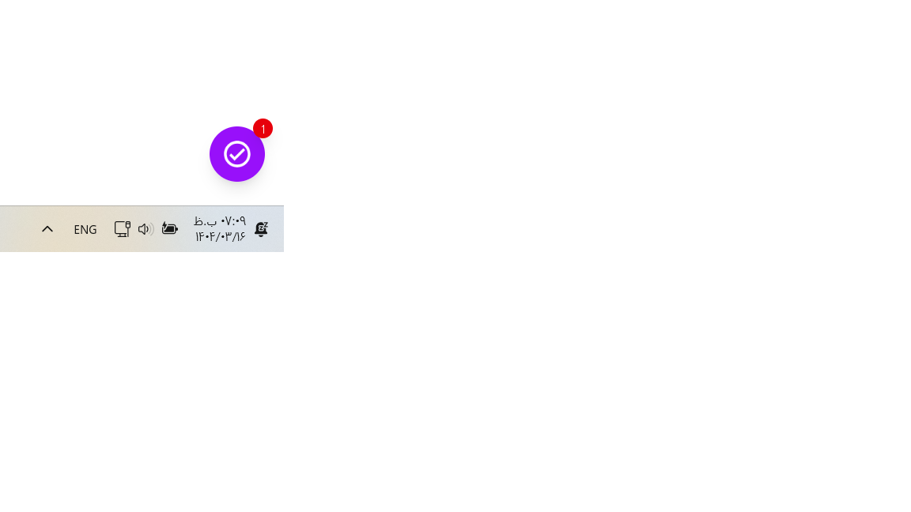
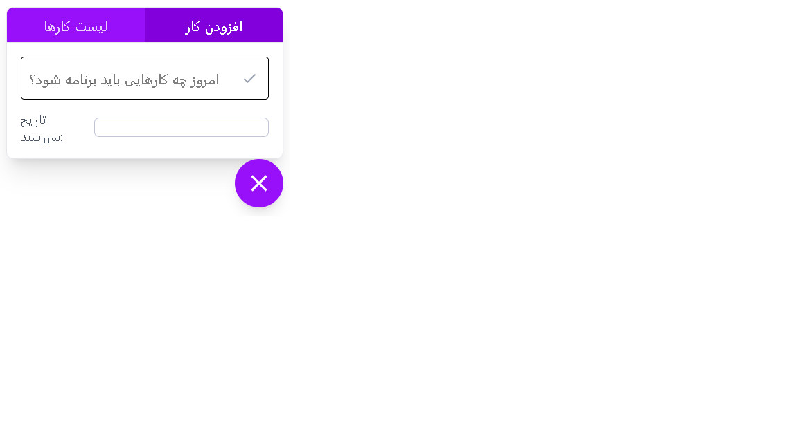
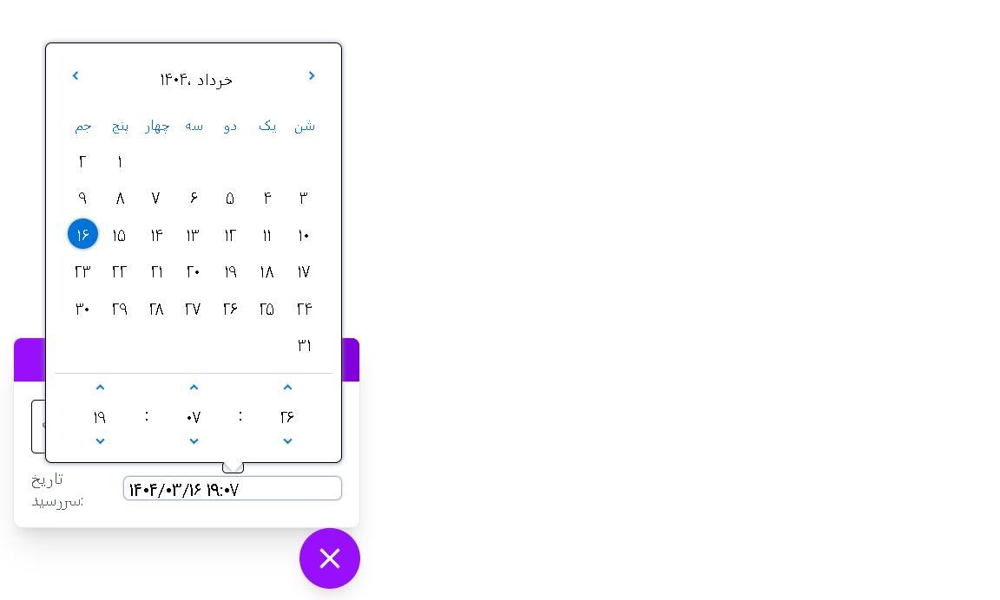
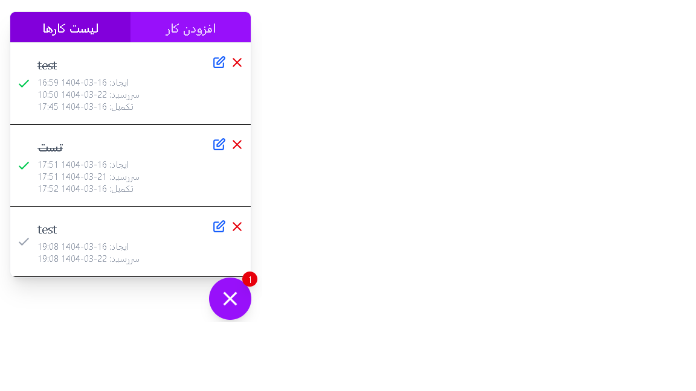

````markdown
# React + Vite Persian Todo App

This project is a minimal setup of a Todo application using **React + Vite**, configured with **TailwindCSS**, **Jalali calendar**, and some essential packages for Persian users.

## 🔧 Installation Steps (EN)

1. Install latest Node.js
2. Create the project:

```bash
npm create vite@latest
# Project name: todo-project-vite-react
# Framework: React
# Variant: JavaScript
````

3. Navigate to the folder and install packages:

```bash
cd todo-project-vite-react
npm install
npm run dev
```

4. Install TailwindCSS:

```bash
npm install tailwindcss @tailwindcss/vite
```

In `vite.config.js`, add:

```js
import tailwindcss from '@tailwindcss/vite'

export default defineConfig({
  plugins: [react(), tailwindcss()],
})
```

In `src/app.css`, import Tailwind:

```css
@import "tailwindcss";
```

5. Install extra libraries:

```bash
npm install date-fns
npm install @iconify/react
npm install date-fns-jalali
npm install react-multi-date-picker
```

---

## 📝 مراحل نصب پروژه (فارسی)

این پروژه با استفاده از تکنولوژی‌های زیر ساخته شده:

* React + Vite
* TailwindCSS برای استایل‌دهی
* تقویم شمسی با `react-multi-date-picker`
* کتابخانه آیکون با `@iconify/react`

### مراحل نصب:

1. نصب Node.js آخرین نسخه
2. ساخت پروژه با دستور زیر:

```bash
npm create vite@latest
# نام پروژه: todo-project-vite-react
# فریمورک: React
# زبان: JavaScript
```

3. ورود به پوشه و اجرای دستورات نصب:

```bash
cd todo-project-vite-react
npm install
npm run dev
```

4. نصب TailwindCSS و تنظیم آن در `vite.config.js` و `src/app.css`

5. نصب پکیج‌های موردنیاز:

```bash
npm install date-fns
npm install @iconify/react
npm install date-fns-jalali
npm install react-multi-date-picker
```

---

## 📷 تصاویر پروژه

تصاویری از محیط پروژه:

### 🖼️ تصویر ۱



### 🖼️ تصویر ۲



### 🖼️ تصویر ۳



### 🖼️ تصویر ۴



---

### ✍️ نوشته شده توسط: Alireza Labbaf

````

